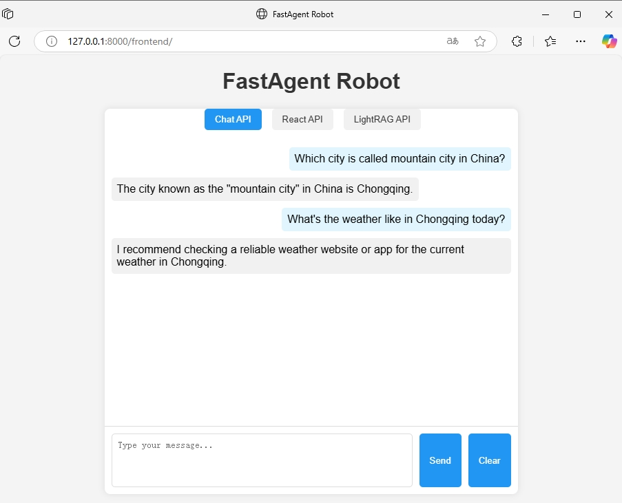
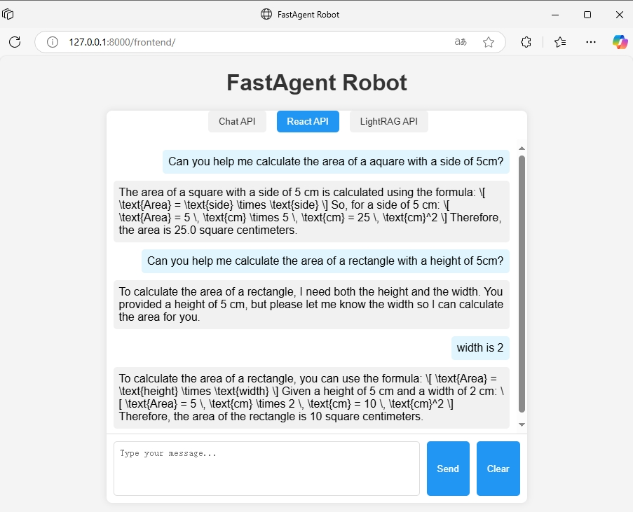
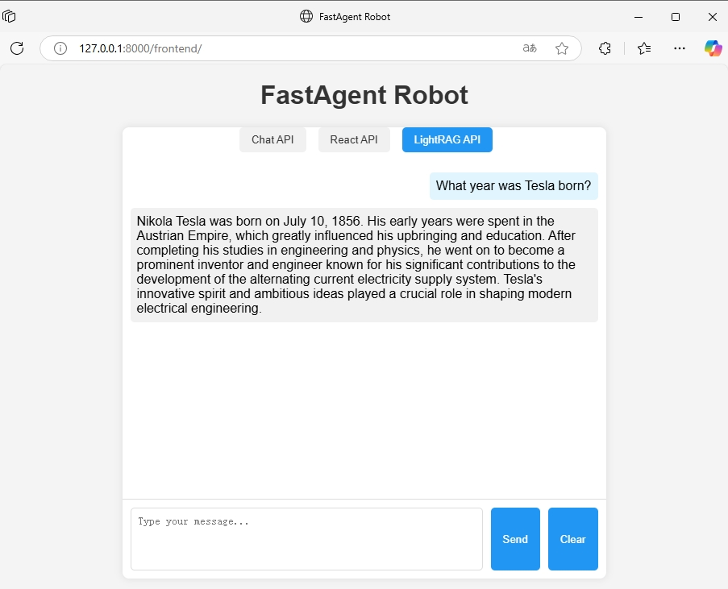

# FastAgent
This is a lightweight, fast, high-concurrency agent framework based on FastAPI. Instead of using LangChain or AutoGen, it **treats a set of APIs as tools**, directly extracts the parameters from these APIs, and then calls the respective API interfaces.


## Features 😎
- By default, interfaces containing "tool" in "tag" are considered as callable tools.
- If the tool cannot be called, return a final answer. The final answer may be for the user to provide additional information, or it may be based on the ability of the large model itself to directly answer the user's question.
- ReAct for planing and reasoning.
- Use [LightRAG](https://github.com/HKUDS/LightRAG), which is faster than [GraphRAG](https://github.com/microsoft/graphrag).
- High-concurrency asynchronous based on FastAPI.


## Quickstart 🚀
- Download repository
```
git clone https://github.com/StudyExchange/fastagent.git
```

- Install pkgs
```
cd fastagent
pip install -r requirements.txt
```

- Setup environment
```
export OPENAI_API_KEY="sk-xxx"
export OPENAI_BASE_URL="https://xxx/v1"
export OPENAI_MODEL_NAME="gpt-4o-mini"
```
or for windows
```
set OPENAI_API_KEY="sk-xxx"
set OPENAI_BASE_URL="https://xxx/v1"
set OPENAI_MODEL_NAME="gpt-4o-mini"
```
or for pydantic_settings ```.env``` file
```
OPENAI_API_KEY="sk-xxx"
OPENAI_BASE_URL="https://xxx/v1"
OPENAI_MODEL_NAME="gpt-4o-mini"
```
or for VScode ```launch.json``` environment
```
{
    "version": "0.2.0",
    "configurations": [
        {
            "name": "Python: Current File",
            "type": "debugpy",
            "request": "launch",
            "program": "${file}",
            "console": "integratedTerminal",
            "justMyCode": true,
            "env": {
                "PYTHONPATH": "${workspaceFolder}",
                "OPENAI_API_KEY"="sk-xxx",
                "OPENAI_BASE_URL"="https://xxx/v1",
                "OPENAI_MODEL_NAME"="gpt-4o-mini",
            },
        }
    ]
}
```

- Start
```
python main.py
```
or
```
uvicorn main:app --host 0.0.0.0 --port 8000
```
- Open [frontend](http://127.0.0.1:8000/frontend) or [swaggerUI](http://127.0.0.1:8000/docs)


## Useage
- Open ```http://127.0.0.1:8000/frontend``` at local browser.



- Reload documents for LightRAG
```
python -m services.rag_service
```

## Swagger docs
Open ```http://127.0.0.1:8000/docs``` at local browser.


## Docker
- create ```.env``` file at project folder, or setup environments when docker container start
```
OPENAI_API_KEY="sk-xxx"
OPENAI_BASE_URL="https://xxx/v1"
OPENAI_MODEL_NAME="gpt-4o-mini"
```

- build
```
docker build -t fastagent .
```

- docker run
```
docker run -it -p 8000:8000 fastagent
```
or
```
docker run -it -p 8000:8000 \
  -e OPENAI_API_KEY="sk-xxx" \
  -e OPENAI_BASE_URL="https://xxx/v1" \
  -e OPENAI_MODEL_NAME="gpt-4o-mini" \
  fastagent
```


## Suport LLM
- GPT
- Qwen
- GLM
- Other LLM with standard openai API


## Development 🛠️
- Clone the repository
- Open project folder in VSCode
- Create conda env and VSCode select env
- ```pip install -r requirements.txt```
- **Develop new APIs as tools**
- Modify prompt for custom advanced develpment


## Test
- Run pytest
```
pytest --cov --cov-report=term --cov-report=html
```
- Open the ```htmlcov/index.html``` file with a browser to view code coverage


## License
This project is licensed under the MIT License.
