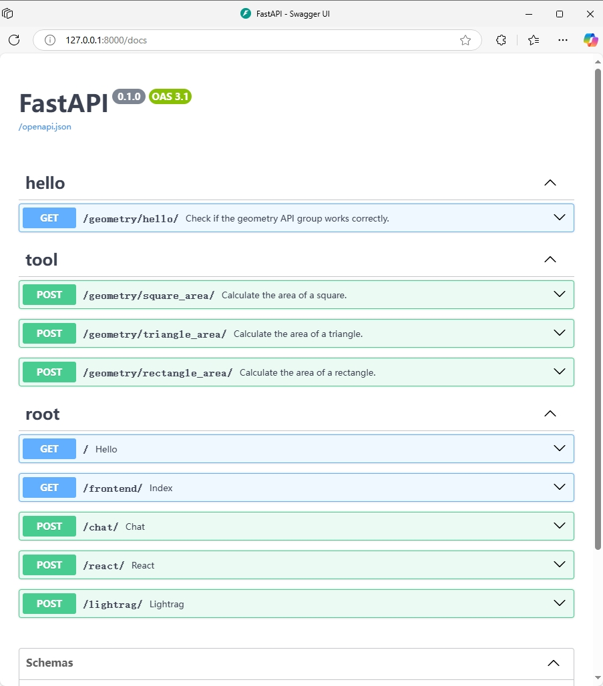

# FastAgent
This is a lightweight and fast agent framework based on FastAPI. Instead of using LangChain or AutoGen, it treats a set of APIs as tools, directly extracts the parameters from these APIs, and then calls the respective API interfaces.


## Features
- By default, interfaces containing 'tool' in 'tag' are considered as callable tools.
- If the tool cannot be called, return a final answer. The final answer may be for the user to provide additional information, or it may be based on the ability of the large model itself to directly answer the user's question.


## Useage
Open ```http://127.0.0.1:8000/frontend/``` at local browser.


## Swagger docs
Open ```http://127.0.0.1:8000/docs``` at local browser.



## Quickstart
- Download repository
```
git clone https://github.com/StudyExchange/fastagent.git
```

- Install pkgs
```
cd fastagent
pip install -r requirements.txt
```

- Setup environment
```
export OPENAI_API_KEY="sk-xxx"
export OPENAI_BASE_URL="https://xxx/v1"
export OPENAI_MODEL_NAME="gpt4-o-mini"
```
or for windows
```
set OPENAI_API_KEY="sk-xxx"
set OPENAI_BASE_URL="https://xxx/v1"
set OPENAI_MODEL_NAME="gpt4-o-mini"
```
or for pydantic_settings ```.env``` file
```
OPENAI_API_KEY="sk-xxx"
OPENAI_BASE_URL="https://xxx/v1"
OPENAI_MODEL_NAME="gpt4-o-mini"
```
or for VScode ```launch.json``` environment
```
{
    "version": "0.2.0",
    "configurations": [
        {
            "name": "Python: Current File",
            "type": "debugpy",
            "request": "launch",
            "program": "${file}",
            "console": "integratedTerminal",
            "justMyCode": true,
            "env": {
                "PYTHONPATH": "${workspaceFolder}",
                "OPENAI_API_KEY"="sk-xxx",
                "OPENAI_BASE_URL"="https://xxx/v1",
                "OPENAI_MODEL_NAME"="gpt4-o-mini",
            },
        }
    ]
}
```

- Start
```
python main.py
```
or
```
uvicorn main:app --host 0.0.0.0 --port 8000
```


## Docker
- build
```
docker build -t fastagent .
```

- docker run
```
docker run -it -p 8000:8000 fastagent
```

## Suport LLM
- GPT
- Qwen
- GLM
- Other LLM with standard openai API


## Contributing
Contributions are welcome! Please feel free to submit a Pull Request.


## License
This project is licensed under the MIT License.
